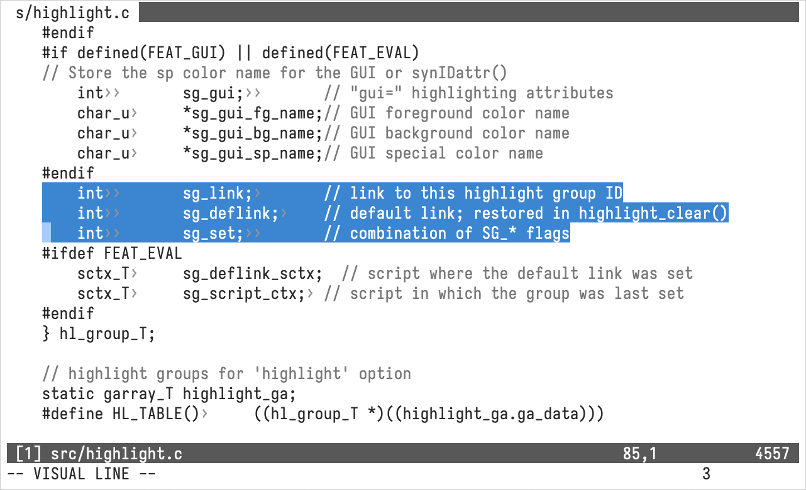

chromatine.vim
==============

A low-colour theme with light and dark variants. It avoids adding colour
for syntax related groups and sticks to using only 256 colours.




Using
-----

If you would like to tweak the accent colours, you can add this to your
`$MYVIMRC`:

```vim
let g:chromatine_accent = { 'light': 32, 'dark': 75 }
```


See Also
--------

  - [casr/vim-colors-reference](https://github.com/casr/vim-colors-reference)
  - [casr/vim-colors-normalise](https://github.com/casr/vim-colors-normalise)
